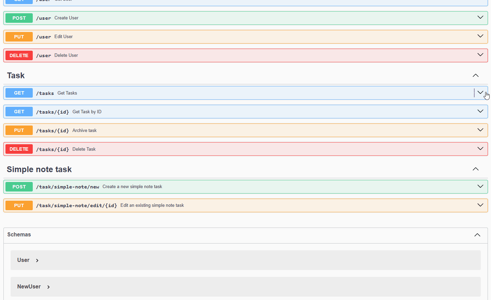

<br>
<a name="readme-top"></a>

<br />
<div align="center">
  <a href="https://github.com/edilan-ribeiro/taskmaster-study">
    
  </a>

<h3 align="center">Taskmaster API</h3>

  <p align="center">
    API de estudo que trabalha com criação de notas de usuário!
  </p>
  
</div>

<br>

<details>
  <summary>Índice</summary>
  <ol>
    <li>
      <a href="#sobre-o-projeto">Sobre o projeto</a>
      <ul>
        <li><a href="#feito-com">Feito com</a></li>
        <li><a href="#desafios-e-aprendizados">Desafios e aprendizados</a></li>
        </ul>
    </li>
    <li><a href="#utilização">Utilização</a></li>
    <li><a href="#contato">Contato</a></li>
  </ol>
</details>

<br><br>
## Sobre o projeto

 


<br><br>

Esse projeto é sobre uma API que trabalha com anotações de usuário em um banco de dados.

O código não esta perfeito nem é o objetivo dele, este projeto pessoal foi feito apenas para meu aprendizado de mongoDB/mongoose!

Uma API (Application Programming Interface) é uma interface que permite a comunicação entre diferentes sistemas ou aplicações.
Ela define como os dados devem ser enviados e recebidos, quais são os formatos aceitos, quais são as regras de autenticação, entre outras especificações. 

<br>


<p align="right">(<a href="#readme-top">voltar ao topo</a>)</p>


### Feito com

<div align="center">


</div>

<p align="right">(<a href="#readme-top">voltar ao topo</a>)</p>


## Desafios e aprendizados

🧰 Servidor: Desta vez optei por uma separação de responsabilidades maior nos arquivos, além de validações básicas de dados. Este não é um MVC completo nem lida com autenticação de usuário.

🗂 Banco de dados: mongoose é um framework utilizado para modelagem de dados em MongoDB. Foi uma experiência de descoberta utilizar um banco de dados NoSQL e um desafio entender suas diferenças como discriminator, refs e querys.

🤓📚 Documentação e testes: Para ter documentar e garantir o bom funcionamento da API foi utilizado o Swagger UI que permite visualizar e interagir a API utilizando seus parâmetros e respostas em uma interface amigável e padronizada para os usuários finais.


Em resumo foi possível aprender e praticar:
 - Banco de dados com MongoDB e Mongoose
 - Rotas de uma API e querys para o banco com NodeJS + Express
 - Documentação e testagem com Swagger UI


 <p align="right">(<a href="#readme-top">voltar ao topo</a>)</p>

## Utilização

É importante ter o mongoDB rodando!

Após clonar, baixar ou fazer um fork, utilize o comando abaixo para instalar as dependências do projeto:

```shell
npm install
```

Esse projeto te permite:
- Buscar dados através das rotas GET como por exemplo: dados de usuário e anotações criadas.
- Adicionar anotações e usuários através das rotas POST
- Editar anotações e usuários através das rotas PUT
- Remover anotações e usuários através das rotas DELETE

<p align="right">(<a href="#readme-top">voltar ao topo</a>)</p>

## Contato

💌 Para me mandar uma mensagem basta usar um dos botões abaixo!<br>

  <a href = "mailto:edilanbusiness@gmail.com" target="_blank"></a>
  <a href="https://www.linkedin.com/in/edilan-ribeiro-santos" target="_blank"></a> 
  <a href="https://whatsa.me/5561983769634/?t=Ol%C3%A1,%20vim%20atrav%C3%A9s%20do%20seu%20GitHub!" target="_blank">
  </a>


<p align="right">(<a href="#readme-top">voltar ao topo</a>)</p>
